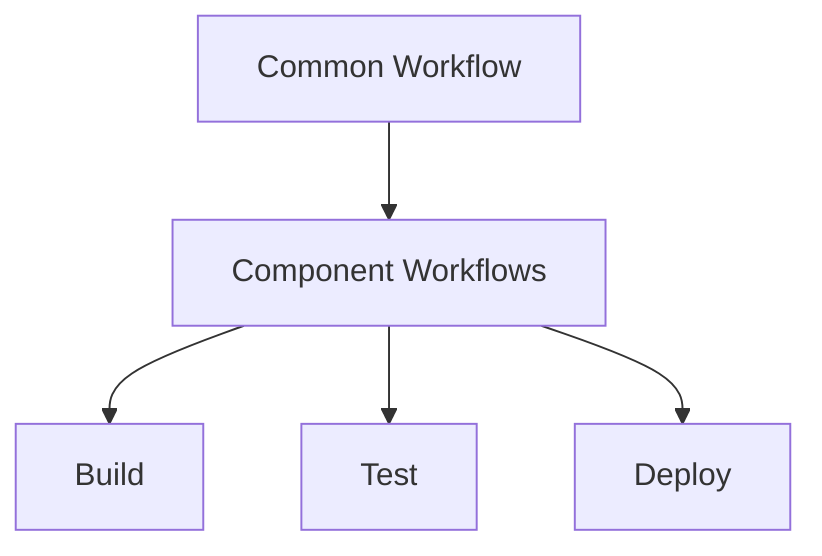

# Keboola App Embeddings V2 - AI Agent Guide

## Repository Overview
This is a monorepo containing multiple components that share a common codebase for embeddings functionality in the Keboola Connection platform. The project is designed to handle text embeddings with support for various providers and vector databases.

## Repository Structure
```bash
keboola.app_embeddings_v2/
├── components/                # All components
│   ├── _common/              # Shared code and configuration
│   ├── app-embeddings-v2/    # UI Application component
│   ├── wr-pgvector-embeddings/ # PostgreSQL writer
│   └── wr-qdrant-embeddings/   # Qdrant writer
```

## Components Overview

### 1. app-embeddings-v2
- UI component for managing embedding operations
- Handles configuration of providers and settings
- Manages vector database connections

### 2. wr-pgvector-embeddings
- Writes embeddings to PostgreSQL with pgvector
- Handles efficient batch writing
- Manages indexes and schema

### 3. wr-qdrant-embeddings
- Manages embeddings in Qdrant vector database
- Supports cloud and self-hosted options
- Handles advanced filtering

## Common Features Across Components

### Embedding Providers Support
| Provider | Models/Features |
|----------|----------------|
| OpenAI | text-embedding-3-small/large, ada-002 |
| Azure OpenAI | Full API support |
| Cohere | English and multilingual models |
| HuggingFace Hub | Custom models support |
| Google Vertex AI | Latest models |
| AWS Bedrock | Titan and Cohere models |

### Configuration Structure
Each component uses:
- `component_config/` directory for configuration files:
  - `configSchema.json` - main component configuration
  - `configRowSchema.json` - row configuration schema
  - Configuration documentation files

## Adding New Components

### 1. Copy Existing Component
```bash
cd components
cp -r wr-pgvector-embeddings your-component-name
```

### 2. Required File Changes
- [ ] Set `VERSION` to `0.0.1`
- [ ] Update `docker-compose.yml` service names
- [ ] Modify configuration files in `component_config/`
- [ ] Add GitHub workflow file

### 3. Add GitHub Workflow
- Copy workflow file from another component
- Update component name in the workflow

## Development Guidelines

### Prerequisites
- Docker
- Docker Compose
- Python 3.12+

### Local Development
1. Navigate to component directory
2. Build and run:
   ```bash
   docker-compose build
   docker-compose up dev
   ```
3. Run tests:
   ```bash
   docker-compose run --rm test
   ```

## CI/CD Pipeline

### Structure


### Process
#### On Pull Request:
- ✓ Build component
- ✓ Run tests
- ✓ Check code style
- ✓ Validate configuration

#### On Merge to Main:
1. Build component
2. Run tests
3. Create new version
4. Deploy to staging
5. Run integration tests
6. Deploy to production

## Important Notes for AI Agents

### 1. Configuration Handling
- Always validate against schema files
- Check for required fields
- Maintain backward compatibility

### 2. Component Modifications
- Keep shared code in _common
- Update version numbers
- Maintain consistent structure

### 3. Testing Requirements
- Unit tests required
- Integration tests for DB operations
- Configuration validation tests

### 4. Documentation Updates
- Keep README files current
- Update configuration examples
- Document API changes

## Environment Variables
Required for CI/CD:
```env
KBC_DEVELOPERPORTAL_USERNAME=your-username
KBC_DEVELOPERPORTAL_PASSWORD=your-password
KBC_DEVELOPERPORTAL_VENDOR=your-vendor
```

---
*Note: This guide is maintained as part of the Keboola App Embeddings V2 project and should be updated when significant changes are made to the repository structure or processes.* 